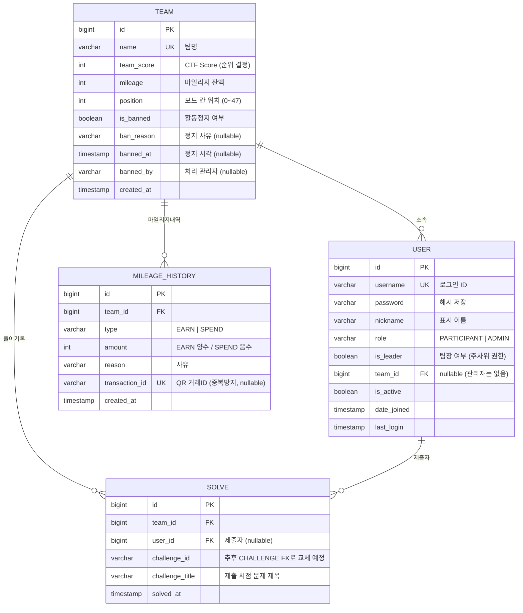

# msg-backend ERD

> **이 문서의 사용법**
> - 이 파일은 **텍스트 기반(Mermaid)** ERD입니다. GitHub / Notion 등에서 자동으로 다이어그램으로 렌더링됩니다.
> - 각자 담당 테이블은 **아래 "담당별 테이블" 섹션에 이어서 추가**해주세요.
> - 어떤 AI를 쓰든 상관없습니다. 이 파일 전체를 복사해서 붙여넣고 *"이 Mermaid ERD에 내 테이블 추가해줘"* 라고 요청하면 됩니다.
> - 수정 시 **PR로 올려주세요.** 이미지가 아니라 텍스트라서 diff로 무엇이 바뀌었는지 보입니다.

담당: 허준하 (로그인 / 마이페이지 / 어드민)
최종 수정: 2026-07-22

---

## 1. 전체 다이어그램 (현재 확정분)



---

## 2. 테이블 상세

### TEAM
팀 단위로 모든 게임 상태를 공유합니다. (2인 1팀 = 말 1개)

| 컬럼 | 타입 | 설명 |
|---|---|---|
| id | bigint PK | |
| name | varchar(50) UK | 팀명, 중복 불가 |
| team_score | int | CTF Score. **점수는 팀 단위로만 관리** (개인 점수 없음) |
| mileage | int | 오프라인 상점용 재화 잔액 |
| position | int | 보드 칸 위치 (0~47, 총 48칸) |
| is_banned | boolean | 활동정지 여부. true면 주사위/플래그제출/인스턴스요청 차단 |
| ban_reason | varchar(255) | 정지 사유 (nullable) |
| banned_at | timestamp | 정지 시각 (nullable) |
| banned_by | varchar(50) | 처리한 관리자 ID (nullable) |
| created_at | timestamp | |

### USER
Django `AbstractUser` 상속. 팀원 2명이 각자 다른 `username`으로 로그인하지만 같은 `team_id`를 가집니다.

| 컬럼 | 타입 | 설명 |
|---|---|---|
| id | bigint PK | |
| username | varchar(150) UK | 로그인 ID (API 명세의 `loginId`) |
| password | varchar | pbkdf2_sha256 해시 |
| nickname | varchar(50) | 화면 표시용 이름 |
| role | varchar(20) | `PARTICIPANT` \| `ADMIN` |
| is_leader | boolean | **팀장 여부. 팀장만 주사위 굴리기 가능** |
| team_id | bigint FK | TEAM 참조, nullable (관리자 계정은 팀 없음), on_delete=SET_NULL |
| is_active / date_joined / last_login | | AbstractUser 기본 제공 |

> ⚠️ **결정 필요**: 팀장은 시딩 시 고정인지, 대회 중 변경(위임) 가능한지

### SOLVE
"어떤 문제를, 누가, 언제 풀었는지" 기록. 마이페이지 풀이기록 조회에 사용.

| 컬럼 | 타입 | 설명 |
|---|---|---|
| id | bigint PK | |
| team_id | bigint FK | TEAM 참조, on_delete=CASCADE |
| user_id | bigint FK | USER 참조, nullable, on_delete=SET_NULL (유저 삭제돼도 기록은 유지) |
| challenge_id | varchar(50) | **임시로 문자열. CHALLENGE 테이블 완성 후 FK로 교체 예정** |
| challenge_title | varchar(200) | 제출 시점의 문제 제목 (문제 제목이 나중에 수정돼도 당시 기록 보존) |
| solved_at | timestamp | 해결 시각 (UTC) |

### MILEAGE_HISTORY
마일리지 증감 내역. 잔액(`TEAM.mileage`)만으로는 "어떻게 그 잔액이 됐는지"를 알 수 없어 별도 관리.

| 컬럼 | 타입 | 설명 |
|---|---|---|
| id | bigint PK | |
| team_id | bigint FK | TEAM 참조, on_delete=CASCADE |
| type | varchar(10) | `EARN`(획득) \| `SPEND`(사용) |
| amount | int | EARN은 양수, SPEND는 음수 (전부 더하면 잔액) |
| reason | varchar(255) | 사유 (참가자에게 그대로 노출됨) |
| transaction_id | varchar(100) UK | QR 결제 서비스의 거래 ID. 중복 알림 방지(멱등성)용, nullable |
| created_at | timestamp | |

> **마일리지 연동 방식(확정)**: QR 결제는 **별개 서비스**. 결제 발생 시 QR 서비스가 우리 API(`POST /api/v1/webhooks/mileage-payment`)로 알림 → 우리 DB에 SPEND 기록 저장 + 잔액 차감. 조회는 항상 우리 DB에서만 함.

> ⚠️ **결정 필요**
> - 관리자 수동 조정을 별도 type(`ADMIN_ADJUST`)으로 기록할지
> - 퍼스트블러드(퍼블) 보상을 이 테이블에 기록할지, 별도 체계인지

---

## 3. 담당별 테이블 (각자 추가해주세요)

아래는 아직 작성되지 않은 영역입니다. **자기 담당 테이블을 이 섹션에 추가하고 PR을 올려주세요.**

### 보드 / 문제 담당
```
[여기에 CHALLENGE, BOARD_TILE, CHANCE_CARD 등 추가]
```

예상되는 연결 관계 (참고용):
- `SOLVE.challenge_id` → `CHALLENGE.id` (현재는 varchar, FK로 교체 필요)
- `TEAM.position` → `BOARD_TILE.position` (보드 칸 번호)

### 인스턴스 담당
```
[여기에 INSTANCE 등 추가]
```

예상되는 연결 관계 (참고용):
- `INSTANCE.team_id` → `TEAM.id`
- `INSTANCE.challenge_id` → `CHALLENGE.id`
- ⚠️ 인스턴스 상태 enum은 scheduler 담당과 합의 필요 (초안: PENDING / RUNNING / FAILED / TERMINATED)

---

## 4. 공통 규칙

- 테이블/컬럼명은 **snake_case**
- 모든 시각 컬럼은 **UTC 기준 timestamp**로 저장, 시간대 변환은 프론트에서 처리
- PK는 Django 기본값(`BigAutoField`) 사용
- 삭제 정책
  - 팀이 사라지면 그 팀의 하위 기록도 삭제 → `CASCADE`
  - 유저가 사라져도 기록 자체는 보존 → `SET_NULL`
- 대량 초기 데이터(팀 150개, 문제 35개, 보드 48칸)는 **시딩 스크립트로 일괄 입력**. 관리자 화면에서는 개별 수정(PATCH)만 지원

---

## 5. 변경 이력

| 날짜 | 내용 |
|---|---|
| 2026-07-22 | 최초 작성 (TEAM, USER, SOLVE, MILEAGE_HISTORY) |
| 2026-07-22 | 개인 점수(`USER.score`) 제거 → 팀 점수만 관리하기로 결정 |
| 2026-07-22 | `USER.is_leader` 추가 (팀장만 주사위 굴리기 가능) |
